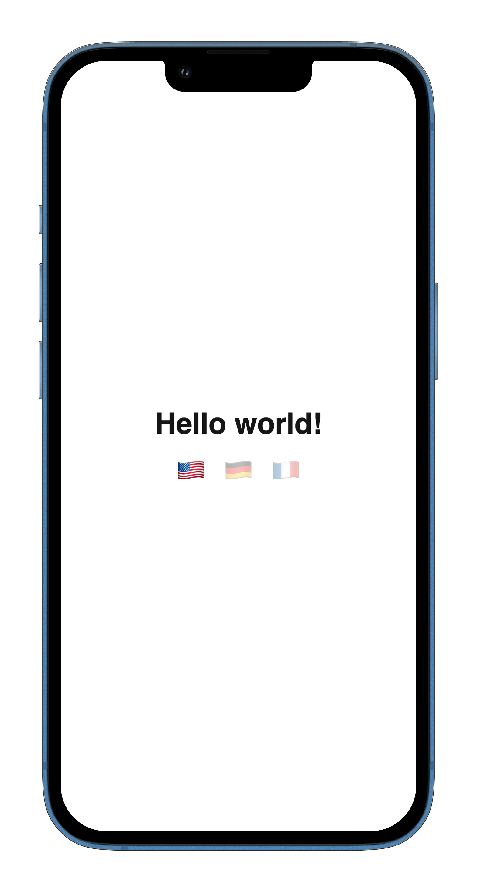

# Example: Localization base

This repository demonstrates some essential concept of the [UIX](https://uix.unyt.org) framework such as [SSR](https://unyt.org/glossary#ssr) and localization (multi language support).


## Installation
1. Install the **UIX command line tool** following the [Getting Started](https://docs.unyt.org/manual/uix/getting-started#the-uix-command-line-tool) guide in our documentation.

2. Clone this repository to your local machine:

	```bash
	$ git clone https://github.com/unyt-org/example-localization.git
	```
3. Run the project local
	```bash
	$ uix -wlb --port 8000
	```
6. Navigate to your favourite web browser and open http://localhost:8000 to see everything in action. 

## Structure
This diagram outlines the UIX default project structure.
Since everything is rendered on the server there is just a [back-end](https://unyt.org/glossary#back-end) folder.
```
.
└── example-localization/
    ├── backend/
    │   ├── .dx                 // Config file for deployment
    │   └── entrypoint.tsx      // Back-end entrypoint
    ├── common/
    │   ├── compoments/
    │   │   └── Main.tsx        // Main component
    │   └── data.dx             // Localization file
    ├── frontend/
    │   ├── entrypoint.scss     // Style declaration
    │   └── entrypoint.tsx      // Front-end entrypoint
    ├── app.dx                  // Endpoint config file
    └── deno.json               // Deno config file
```

## Features
* Multi-language support for static, hybrid and server-side rendering

## Preview



## Explanation
### Environment Variables
In [DATEX](https://datex.unyt.org), environment variables can be accessed using `Datex.Runtime.ENV`. Changing `Datex.Runtime.ENV` modifies the user language.


---

<sub>&copy; unyt 2023 • [unyt.org](https://unyt.org)</sub>
